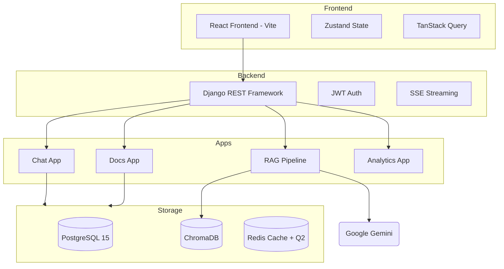

# 🤖 AI-Powered RAG Chatbot

[](https://opensource.org/licenses/MIT)
[](https://www.python.org/downloads/release/python-3110/)
[](https://react.dev/)
[](https://www.docker.com/)
[](https://en.wikipedia.org/wiki/Large_language_model#Retrieval-augmented_generation)

An enterprise-grade Retrieval-Augmented Generation (RAG) chatbot for company database analysis, built with Django REST Framework and React. Empower your team with AI that understands *your* data.

---

## ✨ Features

- **🚀 RAG Chat** — Ask questions about your documents with AI-powered answers, streamed via SSE.
- **🖼️ Multimodal Support** — Upload images and documents as context; Gemini Vision understands diagrams, tables, and screenshots.
- **📂 Document Management** — Upload PDF, DOCX, CSV/XLSX, TXT, and Markdown files with automatic chunking and embedding.
- **🔍 Hybrid & Semantic Search** — Uses `gemini-embedding-2-preview` for unified multimodal vector search across text and images.
- **🏷️ Collections & Tags** — Organize documents into collections; scope queries to specific collections.
- **📜 Query History** — Search, filter, and export past queries.
- **🔖 Saved Searches** — Bookmark frequently used queries for one-click re-use.
- **📤 Export** — Download chat sessions as JSON/Markdown, document lists as CSV.
- **📊 Admin Dashboard** — Usage timeline, query analytics, confidence metrics, user management.
- **🛡️ Security** — JWT auth, rate limiting, CSP headers, HSTS, XSS sanitization.
- **⚡ Performance** — Redis caching, lazy-loaded frontend routes, optimized ORM queries.

## 🛠️ Tech Stack

| Layer | Technology |
|-------|-----------|
| **Backend** | Python 3.11, Django 5, Django REST Framework |
| **Frontend** | React 19, TypeScript 5, Vite 7, Tailwind CSS 4 |
| **AI/ML** | Google Gemini 2.5 Flash, **Gemini Embedding 2.0 (Multimodal)** |
| **RAG Framework** | LangChain 0.3+ |
| **Vector Store** | ChromaDB (Auto-expanding) |
| **Database** | PostgreSQL 15 |
| **Cache / Queue** | Redis 7, Django-Q2 |
| **Auth** | SimpleJWT (access 15 min / refresh 7 days) |
| **API Docs** | drf-spectacular (Swagger UI at `/api/docs/`) |

## 📐 Architecture



## 🚀 Quick Start

### Prerequisites

- Docker & Docker Compose
- Google AI API key ([ai.google.dev](https://ai.google.dev))

### 1. Clone & configure

```bash
git clone https://github.com/midlaj-muhammed/AI-Powered-RAG-Chatbot.git
cd "AI-Powered RAG Chatbot"
cp .env.example .env   # or create .env from the template below
```

**.env** (minimum required):

```env
GOOGLE_API_KEY=your-gemini-api-key
SECRET_KEY=your-django-secret-key
DEBUG=True
VITE_API_URL=http://localhost:8000/api
DATABASE_URL=postgres://raguser:ragpassword@db:5432/ragchatbot
REDIS_URL=redis://redis:6379/0
```

### 2. Start all services

```bash
make up          # docker compose up -d --build
make migrate     # run Django migrations
make superuser   # create admin user (interactive)
```

Or without Make:

```bash
docker compose up -d --build
docker compose exec backend python manage.py migrate
docker compose exec backend python manage.py createsuperuser
```

### 3. Open the app

| Service | URL |
|---------|-----|
| **Frontend** | [http://localhost:5173](http://localhost:5173) |
| **Backend API** | [http://localhost:8000/api/](http://localhost:8000/api/) |
| **Swagger Docs** | [http://localhost:8000/api/docs/](http://localhost:8000/api/docs/) |
| **Health Check** | [http://localhost:8000/api/health/](http://localhost:8000/api/health/) |

## 📁 Project Structure

```text
.
├── backend/
│   ├── apps/
│   │   ├── analytics/   # Dashboard & usage analytics
│   │   ├── chat/        # Sessions, messages, history, export
│   │   ├── documents/   # Upload, process, collections, tags
│   │   ├── rag/         # LangChain pipeline, embeddings, prompts
│   │   └── users/       # Auth, roles, admin user management
│   ├── config/          # Django settings & URL conf
│   ├── utils/           # Shared utilities, middleware, exceptions
│   └── requirements/    # base.txt, dev.txt, prod.txt
├── frontend/
│   ├── src/
│   │   ├── api/         # Typed API client & endpoint functions
│   │   ├── components/  # Reusable UI & layout components
│   │   ├── pages/       # Route-level page components
│   │   ├── stores/      # Zustand state stores
│   │   └── lib/         # Utilities (cn helper, etc.)
│   └── vite.config.ts
├── docker-compose.yml
├── Makefile
└── prd.md
```

## 👁️ Vision & Multimodal RAG

The platform now supports full multimodal RAG capabilities using Gemini 2.0:
- **Image Parsing**: Images (JPEG, PNG, WEBP) are automatically processed by the `VisionParser`.
- **Intelligent Descriptions**: Gemini generates context-rich text descriptions of images including OCR of any visible text.
- **Unified Vector Space**: `gemini-embedding-2-preview` maps both text and image descriptions into the same semantic space for seamless retrieval.
- **Chat Attachments**: Upload images directly in any chat session to ask questions about charts, diagrams, or visual data.

## 👥 User Roles

| Role | Permissions |
|------|------------|
| **Admin** | Full access — manage users, view all analytics, CRUD all |
| **Editor** | Upload documents, chat, view dashboard |
| **Viewer** | Chat only (read-only document access) |

## ⚙️ Configuration

Key settings in `backend/config/settings/base.py`:

```python
# Rate limiting
DEFAULT_THROTTLE_RATES = {
    "user": "100/minute",
    "chat": "15/minute",
}

# RAG tuning
RAG_CONFIG = {
    "top_k": 5,
    "similarity_threshold": 0.3,
    "chunk_size": 800,
    "chunk_overlap": 200,
    "temperature": 0.3,
    "max_output_tokens": 2048,
}
```

## 🛠️ Development

```bash
# Backend shell
docker compose exec backend python manage.py shell_plus

# Run tests
docker compose exec backend python manage.py test

# Frontend dev (hot reload runs inside Docker, but for local dev):
cd frontend && npm install && npm run dev

# Rebuild after dependency changes
make build
```

## 🚢 Deployment (Production Checklist)

1. **Set environment variables:**
   - `SECRET_KEY` — unique, random, 50+ characters
   - `DEBUG=False`
   - `ALLOWED_HOSTS` — your domain(s)
   - `CORS_ALLOWED_ORIGINS` — your frontend domain
   - `GOOGLE_API_KEY` — production API key

2. **Database** — Use managed PostgreSQL (AWS RDS, GCP Cloud SQL, etc.)
3. **Redis** — Use managed Redis (ElastiCache, Memorystore, etc.)
4. **Static files** — Run `collectstatic`, serve via nginx or S3/CloudFront
5. **HTTPS** — Enable via reverse proxy (nginx/Caddy), then ensure:
   ```python
   SECURE_SSL_REDIRECT = True
   SECURE_HSTS_SECONDS = 31536000
   ```
6. **Gunicorn** — Replace `runserver` with Gunicorn:
   ```bash
   gunicorn config.wsgi:application --workers 4 --bind 0.0.0.0:8000
   ```

## 🤖 CI/CD

GitHub Actions pipelines are in `.github/workflows/`:

### CI Pipeline (`ci.yml`)

Runs on every push to `main`/`develop` and on pull requests. It performs linting, testing, and security scans.

### CD Pipeline (`deploy.yml`)

Triggered on merge to `main` or manually. Handles multi-stage Docker builds and automated deployment to staging/production.

### Required Secrets

Configure these in **Settings → Secrets and variables → Actions**:
- `STAGING_HOST`, `STAGING_USER`, `STAGING_SSH_KEY`
- `PRODUCTION_HOST`, `PRODUCTION_USER`, `PRODUCTION_SSH_KEY`

## 🤝 Contributing

Contributions are what make the open source community such an amazing place to learn, inspire, and create. Any contributions you make are **greatly appreciated**.

Please see the [CONTRIBUTING.md](CONTRIBUTING.md) for details on our code of conduct, and the process for submitting pull requests to us.

## 🔒 Security

We take security seriously. Please see our [SECURITY.md](SECURITY.md) for reporting vulnerabilities.

## 📄 License

Distributed under the MIT License. See [LICENSE](LICENSE) for more information.

---
Built with ❤️ by the AI-Powered RAG Chatbot Team
